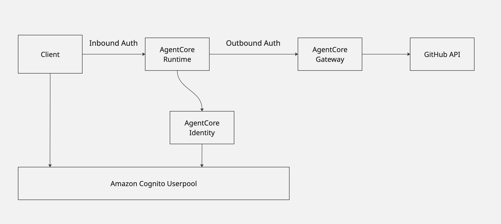

# AgentCore Basic Architecture Sample (Langfuse)
Amazon Bedrock AgentCoreを利用したAgentのサンプルです。
このサンプルではAgentのベーシックアーキテクチャであるAgentとMCPをホストしたいときに、本番利用に参考になるセキュアかつ運用可能な実装例です。
認証認可のやりとりをManagedなAgentCore Identity に任せたアーキテクチャを採用しています。

## サンプルの対象者
* Amazon Bedrock AgentCoreをセキュアにアプリケーションに組み込むイメージがわからない方
* Amazon Bedrock RuntimeでホストしたAgentと、Amazon Bedrock AgentCore GatewayでホストしたMCPとのM2M認証に実装方法がわからない方
* AgentとMCPという基本構成に対してAgentCoreで実装する際のベーシックな実装方法を理解したい方


## 実装機能
GitHubで人気のレポジトリをピックアップしてくれます。

```bash
curl -X POST "https:/xxxxx/invocations \
  -H "Authorization: Bearer $TOKEN" \
  -H "Content-Type: application/json" \
  -d '{
    "prompt": "Get  GitHub trending repositories"
  }'
```

```json
{
  "name": "spring5webapp",
  "url": "https://github.com/ariels7801/spring5webapp",
  "stars": 25,
  "summary": "A comprehensive course for Spring Framework 5 and Spring Boot 2 development. Covers web development, Spring MVC, Spring Data JPA, Hibernate, Thymeleaf, reactive programming, and best practices like Test Driven Development (TDD) and Continuous Integration."
}
```

アプリケーションの組み込み例として、Slack上に定期的に人気のレポジトリをポストしてくれるワークフローのサンプルも用意しています。


## Architecture




* ClientからRuntimeへのアクセスはOAuth2認証でアクセスする
* RuntimeからGatewayは、Agent Ideneity上でホストされているOAuth2Providerからトークンを取得しGatewayにアクセスする
* InboundとOutboundは認証ユーザーに沿って積集合となるようなスコープ設定が必要になるので、それを見据えて同じUserPoolを利用（AgentCoreは非対応）
* GatewayからGitHub APIは、publicに公開されているAPIへのアクセスのため認証は不要


## How to deploy


### 1. Deploy AgentCore Gateway

```bash
cd gateway
```

`setup_agentcore_gateway.ipynb` を利用して、以下の設定を行います。
Notebookを実行することで、以下のリソースが立ち上がります。


* Cognito pool
* appclient 
* Resource Server 
* Lambda Function (Gateway Target)
* Gateway 

この手順で出力される以下の項目は、AgentCore Runtime のOutbound Authの設定で利用するので控えてください。

* DiscoveryURL
* ClientID, ClientSecret
* Resource Server name

### 2. Deploy AgentCore Runtime

AgentCore Runtimeをデプロイします。

```bash
cd runtime/
agentcore configure --entrypoint main.py  --name githubagent
```

実行すると oauth2 の認証設定が求められるので、Gatewayで作成したCognito UserPoolの設定を利用して入力してください

```bash
📋 OAuth Configuration
Enter OAuth discovery URL: xxxxx
Enter allowed OAuth client IDs (comma-separated): xxxxx
```

デプロイ用のコマンドを実行します。

```bash
agentcore launch
```


### 3. Setup AgentCore Runtime Outbound Auth
デプロイ後は、AgentCore Runtime のOutbound Auth (Gateway向けの認証)を設定します。


1. まずは、AgentCore IdentityのOAuth provider を作成します。


* CliendID、ClientSecret等は1で設定したClientを利用してください。  
  * https://docs.aws.amazon.com/ja_jp/bedrock-agentcore/latest/devguide/identity-add-oauth-client-custom.html
* CLIの場合はこちらを適宜変えて実行してください。  
  * https://docs.aws.amazon.com/ja_jp/bedrock-agentcore/latest/devguide/identity-getting-started-step2.html

Dockerfileの環境変数を更新します。

```dockerfile
ENV GATEWAY_ENDPOINT=https://github-mcp-gateway-xxxxxxxxxx.gateway.bedrock-agentcore.us-west-2.amazonaws.com
ENV GATEWAY_SCOPE=my-gateway/invoke
ENV IDENTITY_OAUTH_PROVIDER=resource-provider-oauth-client-xxxxx

```

Gatewayのスコープは、Amazon Cognitoで設定されているスコープを利用します。
手順１でセットアップを行なっている場合、 `{resourceServer}/invoke` となっています。詳細は以下を確認してください。  
https://docs.aws.amazon.com/cognito/latest/developerguide/cognito-user-pools-define-resource-servers.html#cognito-user-pools-define-resource-servers-about-resource-servers


Runtimeで生成されたIAMロールに、Outbound呼び出し時に参照される workload-identityのtokenvalutとprovider、secret managerのアクセス権限を設定します。


```bash
# 1. 管理ポリシーを作成
aws iam create-policy \
  --policy-name BedrockAgentCorePolicy \
  --policy-document file://bedrock-agentcore-policy.json

# 2. ロールにアタッチ
aws iam attach-role-policy \
  --role-name AmazonBedrockAgentCoreSDKRuntime-us-west-2-xxxxxxxx \
  --policy-arn arn:aws:iam::$ACCOUNT_ID:policy/BedrockAgentCorePolicy
```


実際にデプロイできたら、invokeしてみます。環境変数に以下を設定しておくとスムーズです。

* CLIENT_ID
* CLIENT_SECRET
* OAUTH_TOKEN_ENDPOINT
* ACCOUNT_ID
* AGENT_RUNTIME_ID

```bash
AUTH=$(echo -n "{CLIENT_ID}:{CLIENT_SECRET}" | base64)
```

```bash
TOKEN=$(curl -s -X POST $OAUTH_TOKEN_ENDPOINT\
  -H "Authorization: Basic $AUTH" \
  -H "Content-Type: application/x-www-form-urlencoded" \
  -d "grant_type=client_credentials&scope=my-gateway/invoke" | jq -r '.access_token')
```

```bash
curl -X POST "https://bedrock-agentcore.us-west-2.amazonaws.com/runtimes/arn%3Aaws%3Abedrock-agentcore%3Aus-west-2%3A$ACCOUNT_ID%3Aruntime%2F$AGENT_RUNTIME_ID/invocations?qualifier=DEFAULT" \
  -H "Authorization: Bearer $TOKEN" \
  -H "Content-Type: application/json" \
  -H "X-Amzn-Bedrock-AgentCore-Runtime-Session-Id: $(uuidgen)" \
  -d '{
    "prompt": "Get todays GitHub trending repositories"
  }'
```

AgentCoreRuntimeのエンドポイントの詳細はこちら：  
https://docs.aws.amazon.com/ja_jp/bedrock-agentcore/latest/devguide/runtime-mcp.html

Response：

```json
{
  "name": "spring5webapp",
  "url": "https://github.com/ariels7801/spring5webapp",
  "stars": 25,
  "summary": "A comprehensive course for Spring Framework 5 and Spring Boot 2 development. Covers web development, Spring MVC, Spring Data JPA, Hibernate, Thymeleaf, reactive programming, and best practices like Test Driven Development (TDD) and Continuous Integration."
}
```

### (Optional) Setup Sender to Slack 
アプリケーションの組み込み例として、定期的にGitHubのトレンドレポジトリをSlackにポストするコードを用意しています。`send-slack` 以下のコードをLambdaにデプロイすることで、送付することができます。


